# IT/OT Segmentation Lab

A GNS3 lab I built in four stages to practice multi-vendor routing, IT/OT segmentation and network automation. Two routers from different vendors run OSPF. An IT zone and an OT zone sit behind a zone-based firewall. Two Python scripts back up and change the config of both routers. A small monitoring stack shows interface status and traffic.

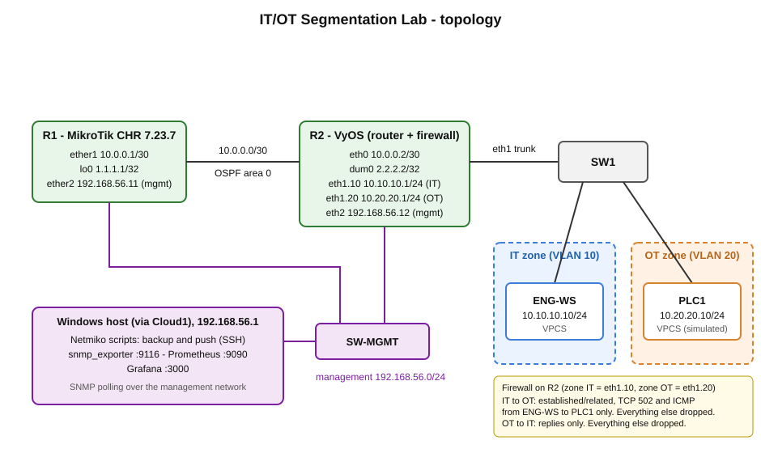

The same lab in GNS3:

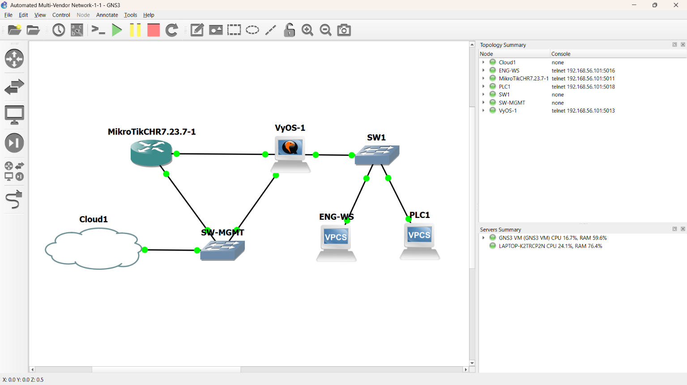

| Phase | What | Status |
|---|---|---|
| 1 | MikroTik CHR and VyOS, OSPF area 0 | Done |
| 2 | IT zone and OT zone behind a firewall, config backup script | Done, except the TCP 502 rule (see below) |
| 3 | Push one config change to both routers from Python | Done |
| 4 | Monitoring with SNMP, Prometheus and Grafana | Done |

Not done: log anomaly detection, a working TCP 502 test, a third vendor, more than two devices. Details at the end.

## Repo layout

```
configs/      latest config of R1 and R2, produced by the backup script
docs/         this diagram and the detailed Phase 3 log
monitoring/   prometheus.yml and the Grafana dashboard (JSON)
screenshots/  evidence for each phase
scripts/      backup_configs.py and push_config.py
backups/      script output, ignored by git
```

## Addressing

| Device | Interface | Address | Purpose |
|---|---|---|---|
| R1 (MikroTik) | ether1 | 10.0.0.1/30 | link to R2 |
| R1 (MikroTik) | lo0 (bridge) | 1.1.1.1/32 | loopback in OSPF |
| R1 (MikroTik) | ether2 | 192.168.56.11/24 | management |
| R2 (VyOS) | eth0 | 10.0.0.2/30 | link to R1 |
| R2 (VyOS) | dum0 | 2.2.2.2/32 | loopback in OSPF |
| R2 (VyOS) | eth1.10 | 10.10.10.1/24 | IT zone gateway (VLAN 10) |
| R2 (VyOS) | eth1.20 | 10.20.20.1/24 | OT zone gateway (VLAN 20) |
| R2 (VyOS) | eth2 | 192.168.56.12/24 | management |
| ENG-WS (VPCS) | | 10.10.10.10/24 | IT host |
| PLC1 (VPCS) | | 10.20.20.10/24 | OT host |

R1 is MikroTik CHR 7.23.7 (RouterOS). R2 is VyOS 2026.09.30-1921-rolling.

## Environment

GNS3 2.2.61 on Windows, with the GNS3 VM in VirtualBox (2 vCPU, 4 GB RAM). KVM is not available in the VM. `systeminfo` reported a hypervisor running on Windows, which probably blocks it. The nodes run in plain QEMU and take a few minutes to boot.

## Phase 1: OSPF between two vendors

R1 and R2 are connected by one link, 10.0.0.0/30, both in OSPF area 0. Each router advertises a loopback.

OSPF neighbor state is Full on both routers:

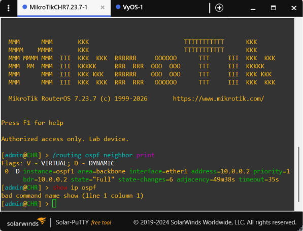

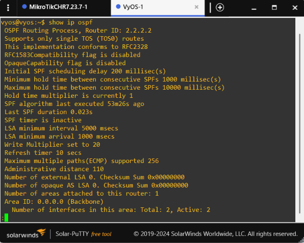

Each router has an OSPF route to the other router's loopback:

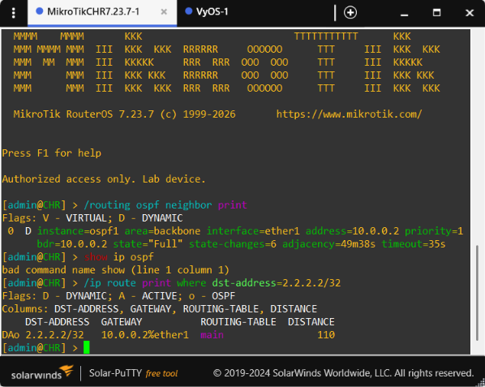

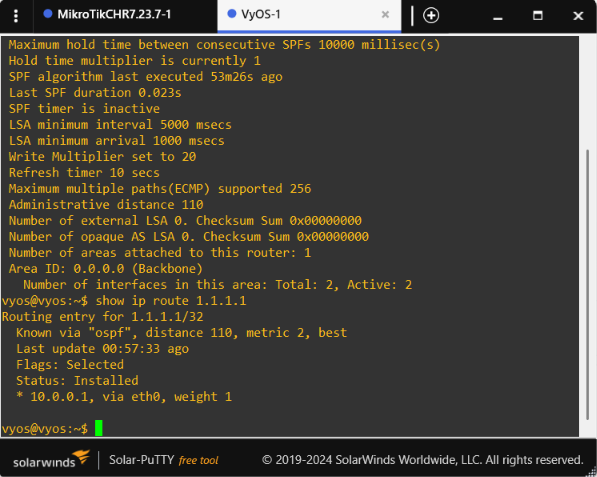

Ping between the loopbacks works in both directions, 0% packet loss:

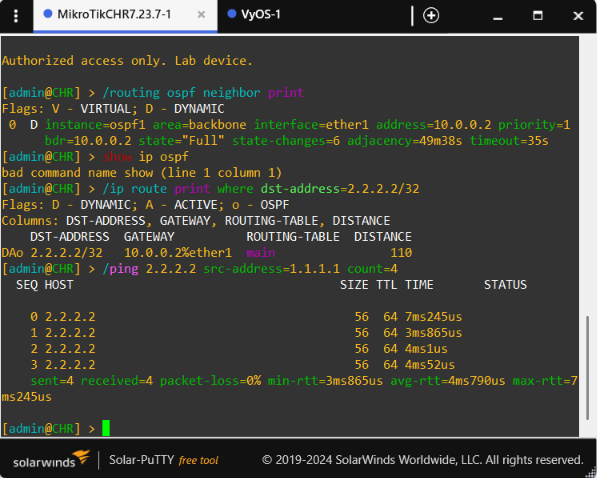

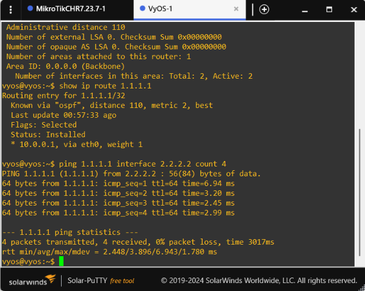

Problems:

- Starting a node failed with "/dev/kvm doesn't exist". I set `enable_kvm = false` under `[Qemu]` in `gns3_server.conf` on the GNS3 VM.
- The GNS3 CHR appliance wizard did not list 7.23.7. I added it as a custom version based on 7.22.1.
- Importing the VyOS appliance from the online registry failed with "appliance_id is a required property". I made a QEMU template by hand and installed VyOS from the ISO onto a blank 4 GB disk with `install image`.
- Pasting config into the telnet console cut off a few lines. I re-entered them and checked the result with `print` and `show` commands.
- The default CHR config had a DHCP client on ether1. I removed it because the link uses a static address.

## Phase 2: IT/OT segmentation and config backup

### Topology additions

- **SW1**: GNS3 Ethernet switch. Port 0 is a trunk to R2 eth1, port 1 is access VLAN 10, port 2 is access VLAN 20.
- **ENG-WS** (VPCS): stands in for an engineering workstation in the IT zone.
- **PLC1** (VPCS): stands in for a PLC in the OT zone. It is only a simulated host. No PLC or Modbus software runs on it.
- **SW-MGMT and Cloud1**: a small management network so my Windows PC can reach both routers.

### Segmentation

R2 is both the router and the firewall. I used the VyOS zone-based firewall: zone IT is eth1.10 and zone OT is eth1.20.

IT to OT:
1. Accept established and related traffic.
2. Accept TCP port 502 from 10.10.10.10 to 10.20.20.10.
3. Accept ICMP from 10.10.10.10 to 10.20.20.10.
4. Everything else is dropped and logged.

OT to IT:
1. Accept established and related traffic (replies only).
2. Everything else is dropped and logged.

The interfaces and the firewall rule set on R2:

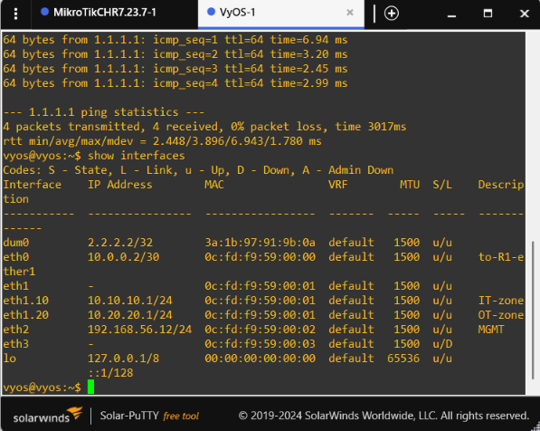

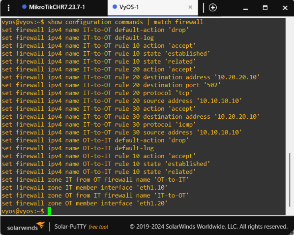

What I tested:

- Before the firewall, ENG-WS could ping PLC1 through R2.
- After the firewall, ENG-WS can still ping PLC1 (305 of 305 replies in one run). PLC1 pinging ENG-WS times out, and `show log firewall` shows those packets dropped by the OT-to-IT rule set.
- A TCP SYN from ENG-WS to PLC1 port 80 gets no answer, and the log shows it dropped by the IT-to-OT default rule.

ENG-WS can ping PLC1:

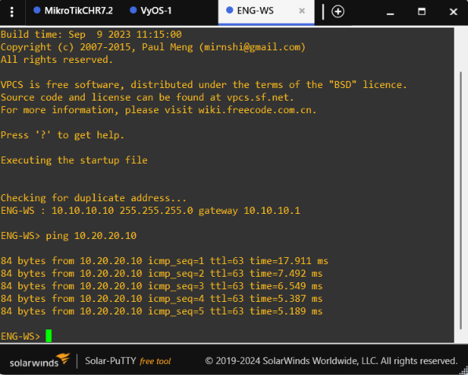

PLC1 cannot ping ENG-WS, and R2 logs the drop:

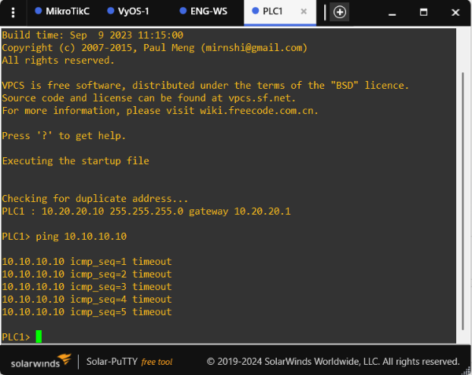

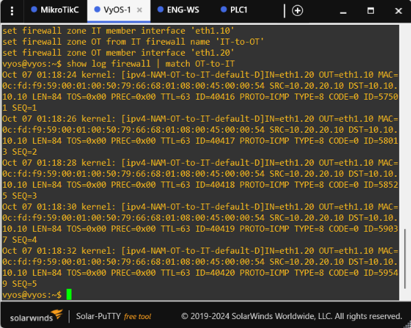

TCP port 80 is dropped and logged:

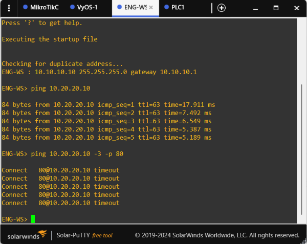

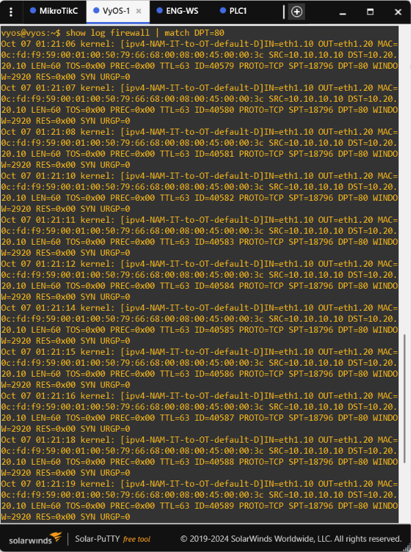

### The TCP 502 rule is not confirmed

I tested it with `ping 10.20.20.10 -3 -p 502` from ENG-WS (VPCS sends a TCP SYN). It got no reply. What I found:

- The SYN passes the firewall, and PLC1 answers with a SYN-ACK.
- The OT-to-IT default rule drops that SYN-ACK, so ENG-WS never sees it. The connection tracking entry on R2 stays in `SYN_SENT`.
- `tcpdump` on eth1.20 shows a SYN-ACK from port 502 back to the right source port, with ack equal to the SYN sequence number plus 1.
- Setting `nf_conntrack_tcp_be_liberal=1` for one test did not help. I set it back to 0.

The test and the connection tracking entry on R2:

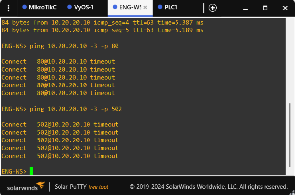

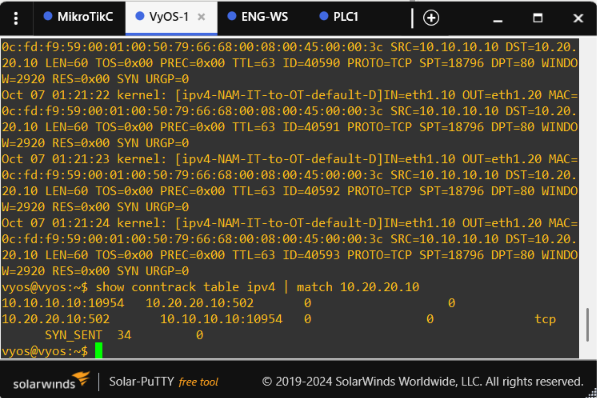

I do not know the cause. VPCS has a very simple TCP stack, so it may be that, but I did not prove it. I did not add a rule to accept the SYN-ACK, because that would open OT to IT just to make a test pass. To close this I would replace PLC1 and ENG-WS with hosts that have a real TCP stack and run a Modbus client and server.

### Config backup script

`scripts/backup_configs.py` uses Netmiko to connect to R1 (`mikrotik_routeros`) and R2 (`vyos`) over SSH. It runs `/export` on R1 and `show configuration commands` on R2, and saves each result in `backups/<date>_<time>/`.

Passwords are not stored in the script. It asks for them when it starts, or reads them from the environment variables `LAB_R1_PASS` and `LAB_R2_PASS`. Lines that contain `password` or `system id` are removed before the file is written. In Phase 3 I added a check that the output looks like a config (R1 must contain `/interface`, R2 must contain `set interfaces`), and removed RouterOS prompt lines from the end of the R1 file.

A run of the script:

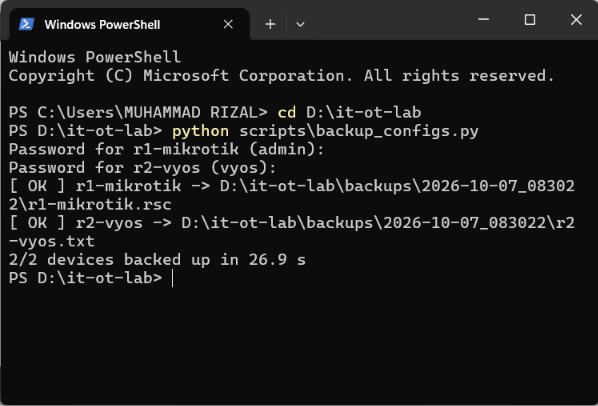

### Timing

I measured the manual way with a stopwatch: from opening the console session and logging in until the command finished printing. This does not include copying the output into a file, so the real manual time is longer than shown.

| Method | R1 | R2 | Both |
|---|---|---|---|
| Manual (login to command done) | 26.86 s | 18.22 s | about 45 s |
| Script, run 1 (login to files saved) | | | 34.2 s |
| Script, run 2 (login to files saved) | | | 26.3 s |

For two devices the script is only a little faster. The difference is that nobody has to sit at the console and nothing is copied by hand. I expect the gap to grow with more devices, but I only measured two.

### Problems

- My Windows PC could not reach the routers until I set Promiscuous Mode to Allow All on Adapter 1 of the GNS3 VM in VirtualBox.
- Windows OpenSSH to MikroTik failed with "message authentication code incorrect" until I forced the `aes128-ctr` cipher. Netmiko connected without any change.
- The first backup showed duplicate OSPF entries and a leftover DHCP client on R1. I found it by reading the backup file, removed the extra entries, and ran the backup again. I do not know how the duplicates got there.

## Phase 3: push one config change to both routers

`scripts/push_config.py` sends the same small change to both routers with Netmiko `send_config_set`. I picked an interface description on the R1-R2 link because it cannot touch routing or the firewall.

| Device | Commands |
|---|---|
| R1 | `/interface ethernet set ether1 comment="to-R2-eth0"` |
| R2 | `set interfaces ethernet eth0 description 'to-R1-ether1'`, `commit`, `save` |

The script treats error words in the output (`invalid`, `failure`, `expected end of command`, `not valid`) as a failure. It has a 60 second read timeout because the first push to R2 failed with "Pattern not detected" when entering config mode. It asks for the router passwords when it starts. It has no rollback: after a failed run one router can be changed and the other not.

`[ OK ]` from the script only means the routers printed no error, so I checked the result by taking a backup before and after and comparing the two. R1 changed by the `ether1` comment only, R2 by the one description line, and nothing else. OSPF, VLANs and the firewall were not touched.

A run of the push script, and the result on both routers:

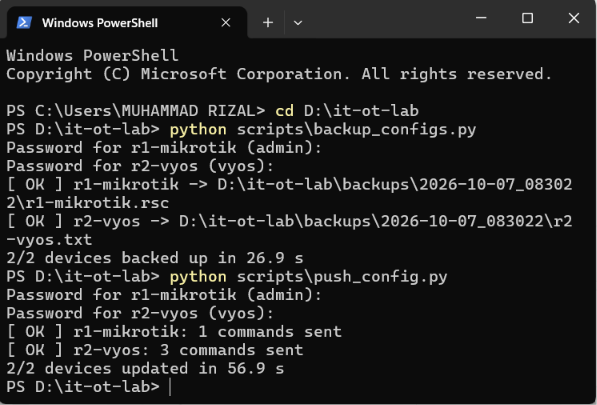

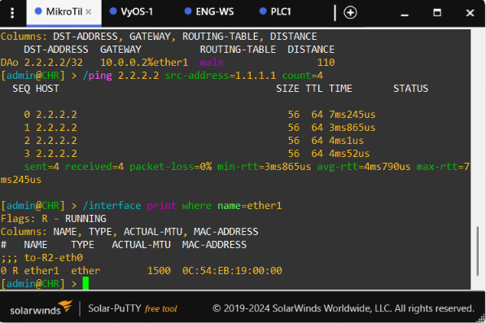

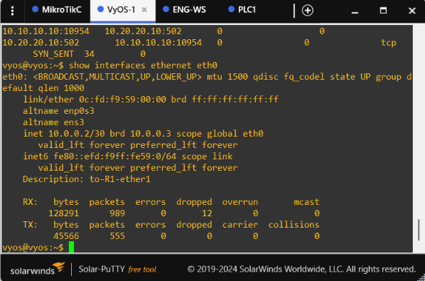

| Method | Time |
|---|---|
| Manual, R1 | 17.26 s |
| Manual, R2 | 79.03 s |
| Manual, both | about 96.3 s |
| Script, both, from a clean state | 60.6 s |

The script was about 36 s faster for two devices. It is one run per method, so it is a rough number. The full step-by-step record, including every failed attempt, is in [docs/phase3-log.md](docs/phase3-log.md).

Problems:

- With a pre-login banner on R2, the backup saved a 76-byte file with only prompts and still printed OK. After I removed the banner it worked again. I tried each way once, so I do not know for sure that the banner was the cause. The config check in the backup script was added because of this.
- In one run the R1 backup ended with a RouterOS prompt and blank lines. It did not happen in other runs and I do not know why. The script now removes those lines.
- VyOS had a kernel panic during boot and then "address already in use" on its console port. I shut down the GNS3 VM, started it again and started VyOS before MikroTik. I did not find the cause of the panic.

## Phase 4: monitoring

Both routers answer SNMP v2c on the management network. `snmp_exporter` turns that into metrics, Prometheus scrapes it every 30 seconds, and Grafana draws the dashboard. I used the standard `if_mib` module, so the dashboard covers interface status, traffic, errors and discards. It does not show OSPF neighbor state.

| Piece | Version | Port |
|---|---|---|
| snmp_exporter | 0.30.1 | 9116 |
| Prometheus | 3.13.4 | 9090 |
| Grafana | 13.2.3 | 3000 |

All three run directly on Windows, outside the repo. I tried Docker first, but the Docker Desktop engine kept returning an internal server error and I did not find the cause. I did not use LibreNMS because the laptop was already at about 86% RAM with GNS3 running.

SNMP answers through snmp_exporter, the Prometheus targets, and the Grafana data source:

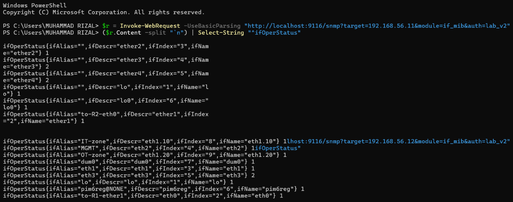

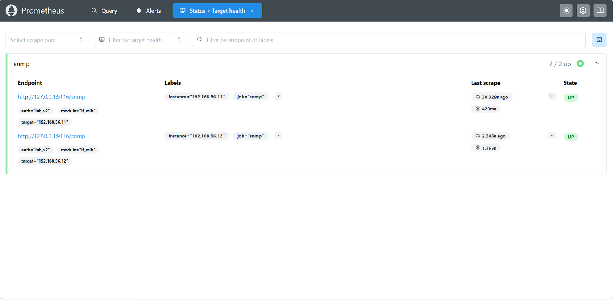

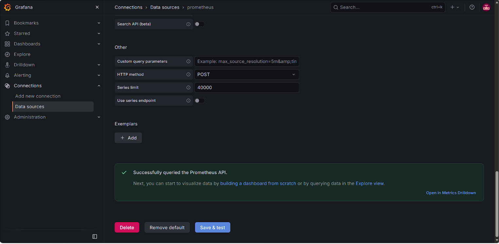

The dashboard (`monitoring/grafana-dashboard.json`) has four panels: whether each router answers SNMP, up/down status per interface, traffic per interface in bits per second, and errors and discards.

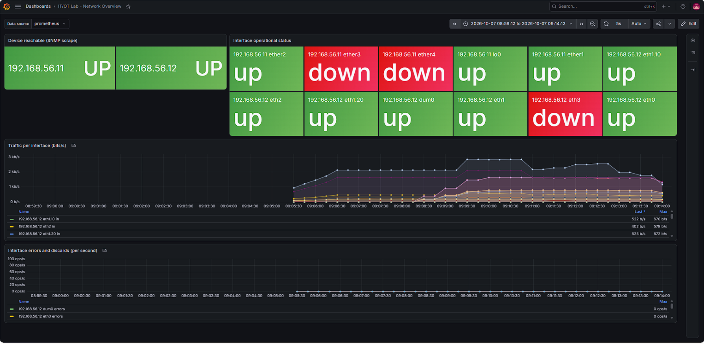

To check that monitoring reports a real change, I disabled `ether1` on R1. The dashboard showed R1 ether1 as down. R2 eth0 stayed up, because GNS3 does not pass the link-down to the other end. After I enabled the interface again it went back to up.

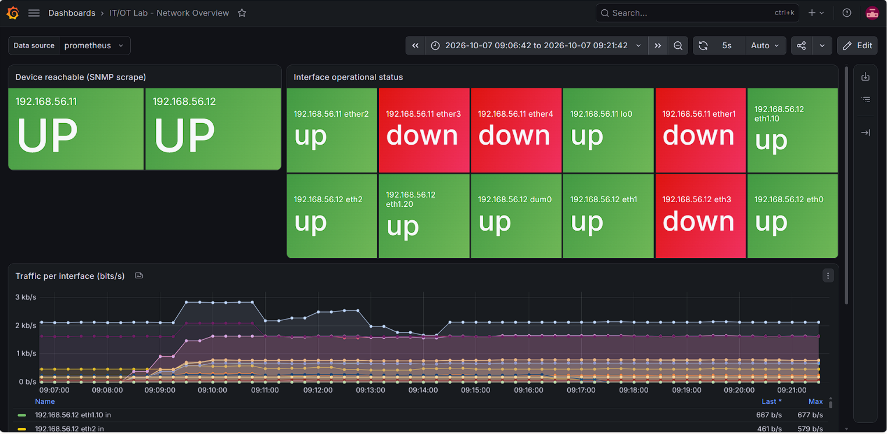

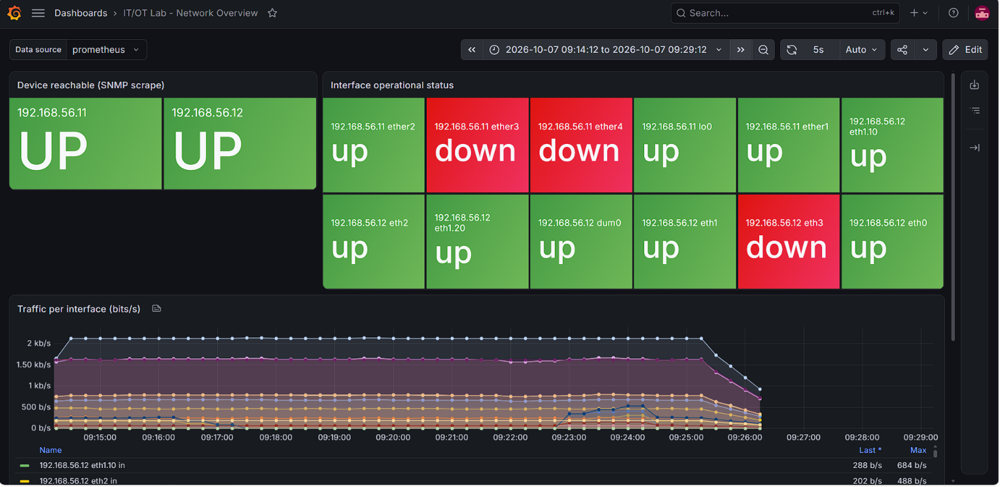

SNMP v2c sends the community string in plain text. This is acceptable only because the management network is a private host-only network in a lab. The community is read-only and limited to 192.168.56.0/24. The file that holds it (`auth-lab.yml`) is not in the repo.

### Setup

R2 (VyOS):

```
set service snmp community <name> authorization 'ro'
set service snmp community <name> network '192.168.56.0/24'
set service snmp listen-address 192.168.56.12
commit
save
```

R1 (MikroTik):

```
/snmp community set [find default=yes] name=<name> addresses=192.168.56.0/24
/snmp set enabled=yes
```

`auth-lab.yml`, next to the snmp_exporter binary:

```
auths:
  lab_v2:
    community: <name>
    version: 2
```

Start the three tools, each in its own window:

```
snmp_exporter.exe --config.file=snmp.yml --config.file=auth-lab.yml
prometheus.exe --config.file=monitoring\prometheus.yml --storage.tsdb.path=<folder outside the repo>
grafana.exe server
```

In Grafana, add a Prometheus data source with URL `http://localhost:9090`, then go to Dashboards, New, Import and upload `monitoring/grafana-dashboard.json`.

### Problems

- The dashboard first showed the interface status as a state timeline with every cell red. The value mapping did not apply, and I do not know why. I switched that panel to a stat panel, where the same mapping works.
- After I left the laptop idle for a few hours, snmp_exporter and Prometheus were no longer running, and R1 and R2 could not be reached from Windows. The SW-MGMT switch was missing from the GNS3 project, and I do not know exactly how it disappeared. I added it again with its three links and started the tools again with the same data folder.

## Running the scripts

```
pip install netmiko
python scripts\backup_configs.py
python scripts\push_config.py
```

Both ask for the router passwords when they start. The backup script can also read them from `LAB_R1_PASS` and `LAB_R2_PASS`.
